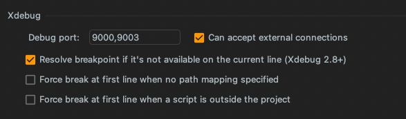
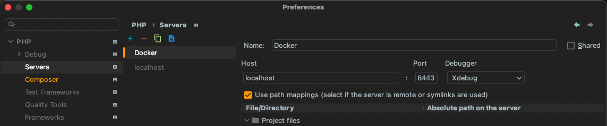

# Wordpress Plugin Dev Environment in Docker

Wordpress docker dev environment (compatible with M1, arm64v8/mysql). Includes XDebug and wp-cli.

## Setup

1. Key-gen in `/wp-server/keys` (for purposes of these docs, all paths are project-relative)
2. `cp .env-template .env`
3. Put your plugin in `/my-plugin`
   1. If you'd like to rename this folder, edit `.env`
   2. If you'd like to auto-enable your plugin, check your plugin name and namespace in  `./docker-compose.yml:46`
4. `docker-compose up`
5. Add any post-install steps in `./docker-compose.yml` > wordpress-cli > command

## Usage

### PHPStorm debug configurations

Do this while you have containers running.

1. Check your IDE global PHP Settings in Settings > PHP > Debug

2. Add a PHP server with Docker & set this as the project interpreter. 

Note: path mappings for wp internal files will be unavailable with this setup. 

### Using wp-cli after instantiation

`docker-compose run wordpress-cli bash`

## Troubleshooting

Permissions with mounted dir and wp-cli?
`RUN chown 33:33 /var/www/html/wp-content/plugins/plugin`

When in doubt, Docker > Troubleshooting > destroy all data .

- - -

## Development on this project

### Improvements
- Download & verify xdebug instead of including in `/lib`
- re-add composer
- move post-install stuff to a separate file mounted/copied to the wp cli image
- secret management/env files
- Auto-gen ssh script
- wp internal path mapping via docker mounted drive?

